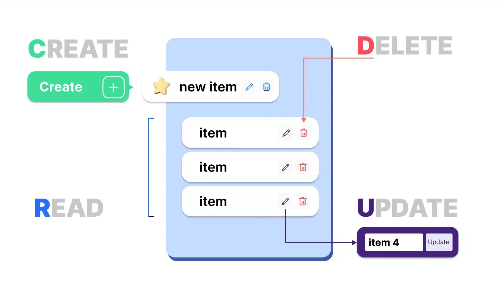
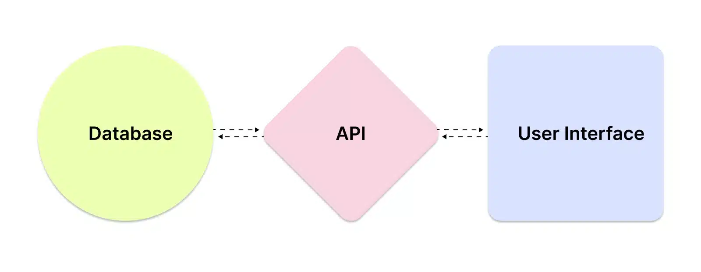
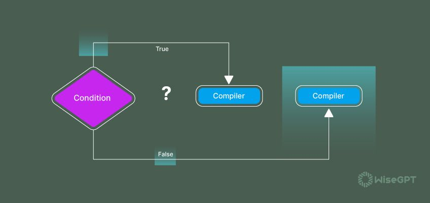
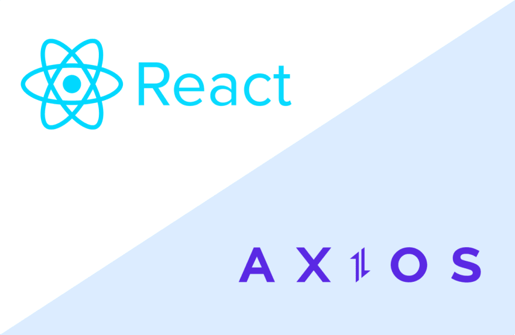

# ¿Qué significa CRUD?



CRUD es un acrónimo que significa cuatro operaciones básicas de gestión de datos: create, read, update, delete/destroy, es decir, crear, leer, actualizar y eliminar. Son acciones que realizamos con cualquier información, en cualquier sistema: en sitios web, en aplicaciones, bases de datos.

Por ejemplo, el administrador de una tienda online puede crear una nueva ficha de producto (create), abrir una antigua (read), cambiar su información (update) o eliminarla (delete).

## Operaciones CRUD

Las operaciones CRUD forman la base de muchos sistemas de gestión de información. Los desarrolladores deben tener en cuenta sus características y relaciones.

Por ejemplo, el administrador de una tienda online no debería tener acceso a la función de eliminar un producto que aún no ha sido creado. Esto parece obvio. Pero al diseñar programas, es necesario tener en cuenta escenarios tan obvios; de lo contrario, los resultados pueden ser inesperados.

### Create

Creación de nuevos registros en la base de datos. Por ejemplo, agregar un nuevo producto al catálogo o registrar un usuario en el sistema. Otras operaciones no son posibles sin create: se realizan en un registro ya creado.

### Read

Lectura: recuperación de datos de la base de datos. Por ejemplo, ver fichas de productos, leer artículos de blogs.

El acceso de lectura puede ser limitado. Por ejemplo, un usuario debería tener acceso a su propio carrito de compras y a su información de pago, pero esta información debería estar oculta en los perfiles de otros clientes.

Leer datos también implica buscarlos. Para ello, necesitas herramientas que te ayuden a encontrar los que necesitas entre miles de productos: filtros, clasificación, búsqueda por palabras clave o número de artículo.

### Update

Realizar cambios en la base de datos. Por ejemplo, un cliente puede actualizar su perfil y un administrador puede cambiar el precio de un producto.

Al cambiar un registro en la base de datos, es importante guardar correctamente la información ingresada anteriormente. Por ejemplo, si un usuario cambia su nombre o actualiza su foto, esto no debería afectar su contraseña o correo electrónico.

### Delete

Eliminar datos que ya no son necesarios. Por ejemplo, un cliente puede eliminar su reseña de un producto, eliminar su cuenta o eliminar artículos de su carrito.

La eliminación puede ser física -sin posibilidad de recuperación- o puede ser lógica: el registro está oculto, pero se puede restaurar si es necesario.

## Aplicaciones CRUD

El modelo CRUD es uno de los conceptos fundamentales en la gestión de datos. Es ampliamente utilizado en el diseño de bases de datos, aplicaciones web, API y otros sistemas de información.

Una aplicación CRUD, o aplicación CRUD, puede denominarse cualquier aplicación móvil o web que permita a los usuarios crear, ver, editar y eliminar registros. Puede escribirse en cualquier idioma y realizar cualquier tarea.

Para crear una aplicación CRUD completa, necesita 3 elementos interactivos:



1. Una base de datos (database) está diseñada para almacenar, administrar y organizar información que una aplicación puede usar y procesar.
2. Una API (app programming interface) es un conjunto de métodos y funciones que permiten a las aplicaciones intercambiar datos. La API permite que la interfaz de usuario acceda a la base de datos para obtener información.
3. La interfaz (user interface, UI) es la parte de la aplicación con la que interactúan los usuarios: ventanas, botones, formularios, menús. La interfaz ayuda a enviar solicitudes y recibir información, hace que la aplicación sea accesible y comprensible para las personas.

### Cómo funciona esto

Por ejemplo, una persona completa un formulario: ingresa nombre, fecha de nacimiento, correo electrónico. Después de hacer clic en el botón Guardar, la API de la aplicación recibe una solicitud HTTP. Se ejecuta una función que envía una solicitud a la base de datos para agregar un nuevo registro. Así es como se implementa la operación de create.

## Conclusión

Las operaciones CRUD son un conjunto de acciones básicas necesarias para gestionar datos en varios sistemas. Crear, leer, actualizar y eliminar datos es la esencia del funcionamiento de muchos sitios web y aplicaciones móviles. Comprender su aplicación y sus relaciones puede mejorar significativamente el desarrollo y diseño de soluciones de software, aumentar su confiabilidad y facilidad de uso.

---
# ¿Qué es un operador ternario?



El operador ternario es un operador único de JavaScript que se utiliza como atajo para la declaración if-else. Es el único operador de JavaScript que acepta tres operandos, de ahí el nombre "ternario". La sintaxis del operador ternario es una condición seguida de un signo de interrogación (?), luego una expresión para ejecutar si la condición es verdadera, seguida de dos puntos (:) y, finalmente, la expresión para ejecutar si la condición es falsa.

En el contexto de React JS, el operador ternario se utiliza con frecuencia para la representación condicional de componentes. Esto significa que lo que se representa en la pantalla puede cambiar según el estado de la aplicación. Por ejemplo, es posible que desee mostrar un mensaje de saludo diferente al usuario según si ha iniciado sesión o no. Aquí es donde entra en juego el operador ternario.

El operador ternario funciona evaluando primero una condición. Si la condición se evalúa como verdadera, ejecuta la primera expresión y, si se evalúa como falsa, ejecuta la segunda expresión. Esto hace que el operador ternario sea una herramienta muy poderosa para tomar decisiones en su código.

## Conceptos básicos del operador ternario

### Sintaxis del operador ternario

El operador ternario es una forma concisa de tomar decisiones en su código JavaScript. Sigue una sintaxis simple:

```JavaScript
  condition ? expressionIfTrue : expressionIfFalse
```
Esta sintaxis se puede leer como: "Si la condición es verdadera, ejecuta la primera expresión. Si es falsa, ejecuta la segunda expresión".

A continuación, se muestra un ejemplo de cómo se puede utilizar el operador ternario en JavaScript:

```JavaScript
    let isLoggedIn = true;

    let message = isLoggedIn ? 'Welcome back!' : 'Please log in.';

    console.log(message); // Outputs: 'Welcome back!'
```
En este ejemplo, la variable isLoggedIn es la condición que se está evaluando. Si isLoggedIn es verdadero, el mensaje '¡Bienvenido de nuevo!' se asigna a la variable de mensaje. Si isLoggedIn es falso, 'Por favor, inicie sesión.' se asigna a la variable de mensaje.
Comprensión de los componentes del operador ternario

El operador ternario consta de tres partes:

Condición: Esta es una declaración que se evalúa como verdadera o falsa.
Expresión si es verdadera: Este es el código que se ejecutará si la condición es verdadera.
Expresión si es falsa: Este es el código que se ejecutará si la condición es falsa.

En el contexto de React, el operador ternario se puede utilizar dentro del método de renderizado de un componente para renderizar elementos de manera condicional. Aquí hay un ejemplo:

```JavaScript
import React from 'react';

    

    function App() {

      let isLoggedIn = true;

      return (

        <div>

          {isLoggedIn ? <h1>Welcome back!</h1> : <h1>Please log in.</h1>}

        </div>

      );

    }

    

    export default App;
```
En este componente de React, usamos el operador ternario dentro de las llaves {} para representar condicionalmente un encabezado "¡Bienvenido de nuevo!" o un encabezado "Inicie sesión", según el valor de isLoggedIn. Este es un ejemplo simple de cómo se puede usar el operador ternario para la representación condicional en React.

## Comparación entre el operador ternario y las declaraciones If-Else

### Ventajas de usar el operador ternario en lugar de If-Else

El operador ternario en React y JavaScript, en general, ofrece varias ventajas en comparación con las declaraciones if-else tradicionales:

1. Concisión: los operadores ternarios son más compactos que las declaraciones if-else, lo que hace que su código sea más limpio y fácil de leer.
2. Uso en línea: a diferencia de las declaraciones if-else, los operadores ternarios se pueden usar directamente dentro de las expresiones, incluidas las declaraciones return y JSX en React.
3. Inmutabilidad: los operadores ternarios funcionan bien con variables constantes en JavaScript, lo que le permite mantener la inmutabilidad de sus variables.

### Situaciones en las que el operador if-else puede ser más adecuado

Si bien el operador ternario es una herramienta poderosa, existen situaciones en las que las instrucciones if-else tradicionales pueden ser más adecuadas:

1. Condiciones complejas: si su condición tiene múltiples ramas, el uso de instrucciones if-else puede hacer que su código sea más fácil de entender.
2. Grandes bloques de código: si el código que se ejecutará para cualquiera de las condiciones tiene varias líneas de longitud, las instrucciones if-else pueden ser más legibles.

## Operador ternario para renderizado condicional en React
### Entender el renderizado condicional

El renderizado condicional en React es una forma de renderizar diferentes componentes o elementos en función de ciertas condiciones. Esta es una característica poderosa que le permite crear interfaces de usuario dinámicas e interactivas.

En React, el renderizado condicional se puede lograr utilizando operadores de JavaScript como el operador ternario. La idea es utilizar estos operadores dentro de su JSX para decidir qué elementos renderizar.

Aquí hay un ejemplo simple de renderizado condicional en React:

```JavaScript
 import React from 'react';

    

    function App() {

      const isLoggedIn = false;

      return (

        <div>

          {isLoggedIn && <h1>Welcome back!</h1>}

        </div>

      );

    }

    

    export default App;

```

En este ejemplo, el elemento h1 solo se representa si isLoggedIn es verdadero. Si isLoggedIn es falso, no se representa nada.

### Implementación de la representación condicional con el operador ternario

El operador ternario es una opción popular para implementar la representación condicional en React debido a su concisión y versatilidad. A continuación, se muestra cómo puede utilizar el operador ternario para la representación condicional:

```JavaScript

import React from 'react';

    

    function App() {

      const isLoggedIn = false;

      return (

        <div>

          {isLoggedIn ? <h1>Welcome back!</h1> : <h1>Please log in.</h1>}

        </div>

      );

    }

    

    export default App;
```
En este ejemplo, si isLoggedIn es verdadero, se representa el elemento h1 con el texto '¡Bienvenido de nuevo!'. Si isLoggedIn es falso, se representa el elemento h1 con el texto 'Inicie sesión'. Esto nos permite cambiar dinámicamente lo que se muestra al usuario en función de su estado de inicio de sesión.

## Mejores prácticas y errores que se deben evitar

Si bien los operadores ternarios anidados pueden ser útiles, también pueden dificultar la lectura y la comprensión del código si se usan en exceso. A continuación, se incluyen algunas prácticas recomendadas y errores que se deben evitar:

1. Evite la anidación profunda: si se encuentra anidando más de dos operadores ternarios, considere usar declaraciones if-else o declaraciones switch en su lugar.
2. Use paréntesis para mayor claridad: si usa operadores ternarios anidados, use paréntesis para indicar claramente el orden de las operaciones.
3. Manténgalo simple: si sus condiciones o expresiones son complejas, considere dividirlas en variables o funciones para facilitar su lectura.

---
---
# ¿Qué tipo de solicitud de API hacemos cuando queremos eliminar datos?

## Solicitud DELETE simple con axios

Esto envía una solicitud HTTP DELETE a la api Reqres que es una api REST en línea falsa que incluye una ruta/api/posts/: id que responde a las solicitudes DELETE con una respuesta HTTP 204. Cuando se recibe la respuesta, el componente React muestra el mensaje de estado 'Eliminar correctamente'.

```JavaScript
componentDidMount() {
    // Simple DELETE request with axios
    axios.delete('https://reqres.in/api/posts/1')
        .then(() => this.setState({ status: 'Delete successful' }));
}
```

## Solicitud DELETE usando axios con ganchos React

Esto envía la misma solicitud DELETE de React usando axios, pero esta versión utiliza ganchos React de un componente de función en lugar de métodos de ciclo de vida de un componente de clase React tradicional. El enlace useEffect React reemplaza el método de ciclo de vida componentDidMount para realizar la solicitud HTTP DELETE cuando se carga el componente.

El segundo parámetro del gancho useEffect React es una matriz de dependencias que determina cuándo se ejecuta el gancho, pasar una matriz vacía hace que el gancho solo se ejecute una vez cuando el componente se carga por primera vez, como el método de estilo de vida componentDidMount en un componente de clase.

```JavaScript
useEffect(() => {
    // DELETE request using axios inside useEffect React hook
    axios.delete('https://reqres.in/api/posts/1')
        .then(() => setStatus('Delete successful'));

// empty dependency array means this effect will only run once (like componentDidMount in classes)
}, []);
```

## Solicitud DELETE usando axios con async/await

Esto envía la misma petición DELETE de React usando axios, pero esta versión usa una función asincrónica y la expresión de espera javascript para esperar a que las promesas regresen (en lugar de usar el método promise then () como anteriormente).

```JavaScript
useEffect(() => {
    // DELETE request using axios with async/await
    async function deletePost() {
        await axios.delete('https://reqres.in/api/posts/1');
        setStatus('Delete successful');
    }

    deletePost();
}, []);
```

## Solicitud DELETE usando axios con manejo de errores

Esto envía una solicitud DELETE de React usando axios a una URL no válida en la api y luego asigna el mensaje de error a la propiedad de estado del componente errorMessage y registra el error en la consola.

```JavaScript
useEffect(() => {
    // DELETE request using axios with error handling
    axios.delete('https://reqres.in/invalid-url')
        .then(response => setStatus('Delete successful'))
        .catch(error => {
            setErrorMessage(error.message);
            console.error('There was an error!', error);
        });
}, []);
```

---
---
# ¿Qué tipo de solicitud de API hacemos cuando queremos actualizar los datos?

## Solicitud PUT simple con un cuerpo JSON usando axios

Esto envía una solicitud HTTP PUT a la api Reqres, que es una api REST en línea falsa que incluye una ruta genérica/api/< resource > que responde a las solicitudes PUT de cualquier < resource > con el contenido del cuerpo de la solicitud y una propiedad updatedAt con la fecha actual. En este ejemplo se envía un objeto de artículo a la ruta/api/articles/1 y, a continuación, se asigna la fecha updatedAt de la respuesta a la propiedad de estado del componente react updatedAt para que se pueda mostrar en el método render () del componente.

```JavaScript
componentDidMount() {
    // Simple PUT request with a JSON body using axios
    const article = { title: 'React PUT Request Example' };
    axios.put('https://reqres.in/api/articles/1', article)
        .then(response => this.setState({ updatedAt: response.data.updatedAt }));
}
```

## Solicitud PUT usando axios con ganchos React

Esto envía la misma solicitud PUT de React usando axios, pero esta versión utiliza ganchos React de un componente de función en lugar de métodos de ciclo de vida de un componente de clase React tradicional. El enlace useEffect React reemplaza el método de ciclo de vida componentDidMount para enviar la solicitud HTTP PUT cuando se carga el componente.

El segundo parámetro del gancho useEffect React es una matriz de dependencias que determina cuándo se ejecuta el gancho, pasar una matriz vacía hace que el gancho solo se ejecute una vez cuando el componente se carga por primera vez, como el método de estilo de vida componentDidMount en un componente de clase.

```JavaScript
useEffect(() => {
    // PUT request using axios inside useEffect React hook
    const article = { title: 'React Hooks PUT Request Example' };
    axios.put('https://reqres.in/api/articles/1', article)
        .then(response => setUpdatedAt(response.data.updatedAt));

// empty dependency array means this effect will only run once (like componentDidMount in classes)
}, []);
```

## Solicitud PUT usando axios con async/await

Esto envía la misma solicitud PUT desde React usando axios, pero esta versión utiliza una función asincrónica y la expresión de espera javascript para esperar a que vuelvan las promesas (en lugar de usar el método promise then () como anteriormente).

```JavaScript
async componentDidMount() {
    // PUT request using axios with async/await
    const article = { title: 'React Put Request Example' };
    const response = await axios.put('https://reqres.in/api/articles/1', article);
    this.setState({ updatedAt: response.data.updatedAt });
}
```

## Solicitud PUT usando axios con manejo de errores

Esto envía una solicitud PUT de React usando axios a una URL no válida en la api y luego asigna el mensaje de error a la propiedad de estado del componente errorMessage y registra el error en la consola.

```JavaScript
componentDidMount() {
    // PUT request using axios with error handling
    const article = { title: 'React PUT Request Example' };
    axios.put('https://reqres.in/invalid-url', article)
        .then(response => this.setState({ updatedAt: response.data.updatedAt }))
        .catch(error => {
            this.setState({ errorMessage: error.message });
            console.error('There was an error!', error);
        });
}
```

---
---
# ¿Qué es el código dinámico?



Muchos proyectos en la web necesitan interactuar con una API REST en algún momento de su desarrollo. Axios es un cliente HTTP ligero basado en el servicio $ http dentro de Angular.js v1.x y es similar a la API de búsqueda de JavaScript nativa.

Axios se basa en promesas, lo que le brinda la capacidad de aprovechar la asincronía de JavaScript y esperar un código asincrónico más legible.

También puede interceptar y cancelar solicitudes, y hay una protección integrada en el lado del cliente contra la falsificación de solicitudes entre sitios.

En este artículo, verá ejemplos de cómo usar Axios para acceder a la popular API de marcador de posición JSON dentro de una aplicación React.

## Requisitos previos

Para seguir este artículo, necesitarás lo siguiente:

- Node.js versión 10.16.0 instalado en el equipo. Para instalar esto en macOS o Ubuntu 18.04, siga los pasos de Cómo instalar Node.js y Crear un entorno de desarrollo local en macOS o la sección Instalación utilizando un PPA de Cómo instalar Node.js en Ubuntu 18.04.
- Un nuevo proyecto de React configurado con Create React App siguiendo el tutorial Cómo configurar un proyecto de React con Create React App.
- También ayudará a tener una comprensión básica de JavaScript, que puede encontrar en la serie Cómo codificar en JavaScript, junto con un conocimiento básico de HTML y CSS.

## Adición de Axios al proyecto

En esta sección, agregará Axios a un proyecto React.

```Shell
npx create-react-app react-axios-example
```

Para agregar Axios al proyecto, abra el terminal y cambie los directorios en el proyecto:

```Shell
cd react-axios-example
```

A continuación, ejecute este comando para instalar Axios:

```Shell
npm install axios@0.24.0
```

A continuación, deberá importar Axios en el archivo en el que desea usarlo.

## Realización de una solicitud GET

En este ejemplo, se crea un nuevo componente y se importa Axios en él para enviar una solicitud GET.

Dentro de tu proyecto de React, necesitarás crear un nuevo componente llamado PersonList.

Primero, cree un nuevo subdirectorio de componentes en el directorio src:

```Shell
mkdir src/components
```

En este directorio, cree PersonList.js y agregue el siguiente código al componente:

src/components/PersonList.js

```JavaScript
import React from 'react';
import axios from 'axios';

export default class PersonList extends React.Component {
  state = {
    persons: []
  }

  componentDidMount() {
    axios.get(`https://jsonplaceholder.typicode.com/users`)
      .then(res => {
        const persons = res.data;
        this.setState({ persons });
      })
  }

  render() {
    return (
      <ul>
        {
          this.state.persons
            .map(person =>
              <li key={person.id}>{person.name}</li>
            )
        }
      </ul>
    )
  }
}
```

Primero, importa React y Axios para que ambos se puedan usar en el componente. A continuación, se conecta al enlace del ciclo de vida de componentDidMount y realiza una solicitud GET.

Utiliza axios.get (url) con una URL de un punto final de API para obtener una promesa que devuelve un objeto de respuesta. Dentro del objeto de respuesta, hay datos que luego se asignan al valor de persona.

También puede obtener otra información sobre la solicitud, como el código de estado en res.status o más información dentro de res.request.

Añade este componente a tu app.js:

src/app.js

```JavaScript
import PersonList from './components/PersonList.js';

function App() {
  return (
    <div ClassName="App">
      <PersonList/>
    </div>
  )
}
```

A continuación, ejecute la aplicación:

```Shell
npm start
```

Ver la aplicación en el navegador. Se le presentará una lista de 10 nombres.

## Realización de una solicitud POST

En este paso, utilizará Axios con otro método de solicitud HTTP denominado POST.

Dentro de tu proyecto de React, necesitarás crear un nuevo componente llamado PersonAdd.

Cree PersonAdd.js y agregue el siguiente código para crear un formulario que permita la entrada del usuario y, posteriormente, publique el contenido en una API:

src/components/PersonAdd.js

```JavaScript
import React from 'react';
import axios from 'axios';

export default class PersonAdd extends React.Component {
  state = {
    name: ''
  }

  handleChange = event => {
    this.setState({ name: event.target.value });
  }

  handleSubmit = event => {
    event.preventDefault();

    const user = {
      name: this.state.name
    };

    axios.post(`https://jsonplaceholder.typicode.com/users`, { user })
      .then(res => {
        console.log(res);
        console.log(res.data);
      })
  }

  render() {
    return (
      <div>
        <form onSubmit={this.handleSubmit}>
          <label>
            Person Name:
            <input type="text" name="name" onChange={this.handleChange} />
          </label>
          <button type="submit">Add</button>
        </form>
      </div>
    )
  }
}
```

Dentro de la función handleSubmit, se impide la acción predeterminada del formulario. A continuación, actualice el estado a la entrada del usuario.

El uso de POST le proporciona el mismo objeto de respuesta con información que puede usar dentro de una llamada.

Para completar la solicitud POST, primero debe capturar la entrada del usuario. Luego agrega la entrada junto con la solicitud POST, que le dará una respuesta. A continuación, puede console.log la respuesta, que debe mostrar la entrada de usuario en el formulario.

Añade este componente a tu app.js:

src/app.js

```JavaScript
import PersonList from './components/PersonList';
import PersonAdd from './components/PersonAdd';

function App() {
  return (
    <div ClassName="App">
      <PersonAdd/>
      <PersonList/>
    </div>
  )
}
```

A continuación, ejecute la aplicación:

```Shell
npm start
```

Ver la aplicación en el navegador. Se le presentará un formulario para enviar nuevos usuarios. Compruebe la consola después de enviar un nuevo usuario.

## Realización de una solicitud DELETE

En este ejemplo, verá cómo eliminar elementos de una API utilizando axios.delete y pasando una URL como parámetro.

Dentro de tu proyecto de React, necesitarás crear un nuevo componente llamado PersonRemove.

Cree PersonRemove.js y agregue el código siguiente para eliminar un usuario:

src/PersonRemove.js

```JavaScript
import React from 'react';
import axios from 'axios';

export default class PersonRemove extends React.Component {
  state = {
    id: ''
  }

  handleChange = event => {
    this.setState({ id: event.target.value });
  }

  handleSubmit = event => {
    event.preventDefault();

    axios.delete(`https://jsonplaceholder.typicode.com/users/${this.state.id}`)
      .then(res => {
        console.log(res);
        console.log(res.data);
      })
  }

  render() {
    return (
      <div>
        <form onSubmit={this.handleSubmit}>
          <label>
            Person ID:
            <input type="number" name="id" onChange={this.handleChange} />
          </label>
          <button type="submit">Delete</button>
        </form>
      </div>
    )
  }
}
```

De nuevo, el objeto res le proporciona información sobre la solicitud. A continuación, puede console.log esa información de nuevo después de enviar el formulario.

Añade este componente a tu app.js:

src/app.js

```JavaScript
import PersonList from './components/PersonList';
import PersonAdd from './components/PersonAdd';
import PersonRemove from './components/PersonRemove';

function App() {
  return (
    <div ClassName="App">
      <PersonAdd/>
      <PersonList/>
      <PersonRemove/>
    </div>
  )
}
```

A continuación, ejecute la aplicación:

```JavaScript
npm start
```

Ver la aplicación en el navegador. Se le presentará un formulario para eliminar usuarios.

## Uso de una instancia base en Axios

En este ejemplo, verá cómo puede configurar una instancia base en la que puede definir una dirección URL y cualquier otro elemento de configuración.

Cree un archivo independiente llamado api.js:

src/api.js

```JavaScript
import axios from 'axios';

export default axios.create({
  baseURL: `http://jsonplaceholder.typicode.com/`
});
```

Una vez configurada la instancia predeterminada, se puede utilizar dentro del componente PersonRemove. La nueva instancia se importa así:

src/components/PersonRemove.js

```JavaScript
import React from 'react';

import API from '../api';

export default class PersonRemove extends React.Component {
  // ...

  handleSubmit = event => {
    event.preventDefault();

    API.delete(`users/${this.state.id}`)
      .then(res => {
        console.log(res);
        console.log(res.data);
      })
  }

  // ...
}
```

Debido a http://jsonplaceholder.typicode.com/ ahora es la URL base, ya no necesita escribir la URL completa cada vez que desee llegar a un punto final diferente en la API.

## Usar async y await

En este ejemplo, verá cómo puede usar async y esperar a trabajar con promesas.

La palabra clave wait resuelve la promesa y devuelve el valor. El valor se puede asignar a una variable.

src/components/PersonRemove.js

```JavaScript
import React from 'react';

import API from '../api';

export default class PersonRemove extends React.Component {
  // ...

  handleSubmit = event => {
    event.preventDefault();

    const response = await API.delete(`users/${this.state.id}`);

    console.log(response);
    console.log(response.data);
  }

  // ...
}
```

En este ejemplo de código, se reemplaza el .then (). La promesa se resuelve y el valor se almacena dentro de la variable de respuesta.
